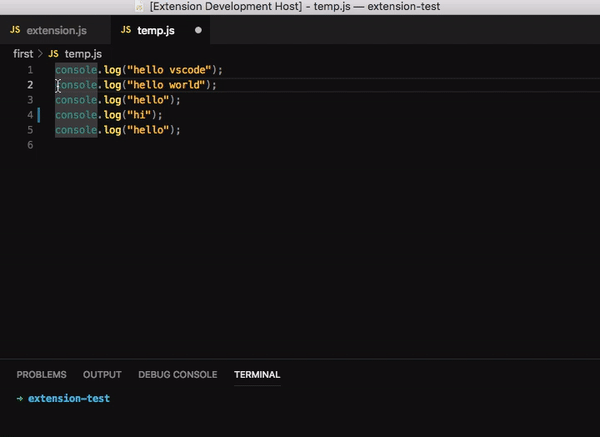

# Replace Selected

Replace Selected is an extension that lets you perform certain actions like replacing words, Undo, Redo etc on a selected area. Currently the extension is in development phase and only replacing words or sentences feature is implemented. Please, feel free to contribute on this project on github. issues and recommendations are all welcomed!

## Features

## 0.0.1

Initial release of replace-selected

**Enjoy!**
